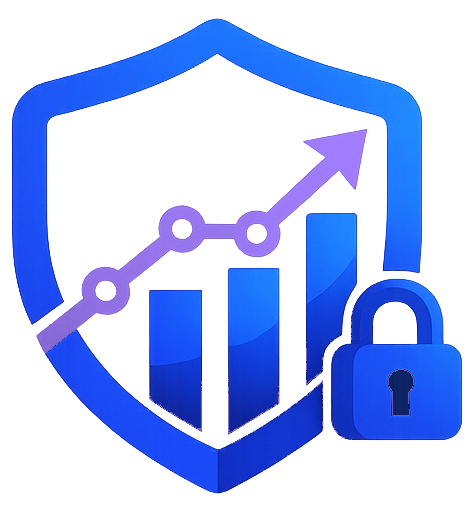

<div align="center">



# CyberMarketTrack

**A self-hosted knowledge base of the cybersecurity market** — vendors, solutions,
and the full history of acquisitions, mergers and renamings, with custom comparators.

[](https://nextjs.org/)
[](https://www.typescriptlang.org/)
[](https://www.prisma.io/)
[](https://www.sqlite.org/)
[](https://www.docker.com/)

[Getting Started](#-getting-started) · [Configuration](#-configuration) · [Usage](#-usage) · [Architecture](./ARCHITECTURE.md) · [Roadmap](#-roadmap)

</div>

---

## 📖 About

CyberMarketTrack turns the messy, fast-moving cybersecurity market into a queryable,
history-aware knowledge base. Companies get **bought, renamed, spun off, merged and
delisted** constantly; this app records those facts as dated **events** and *derives*
the present state from them — so "who owns product X today?" and "what was it called in
2019?" are answered from the same source of truth.

It runs as a **single container** with an embedded SQLite database — ideal for a NAS or a
small VPS — and needs no external services.

### ✨ Features

- **Companies & solutions** — vendors, service providers, distributors and funds, each
  with bilingual (FR/EN) descriptions, logos, country, and a derived timeline.
- **Event-sourced history** — acquisitions (with outcome), mergers, spin-offs, IPOs,
  delistings, HQ relocations, renamings, funding rounds… current names, owners and
  statuses are **always computed**, never stored ([why?](./ARCHITECTURE.md)).
- **Tag taxonomy** — solution types, capabilities and scopes, with fast multi-select
  searchable filters.
- **Comparators** — build side-by-side coverage/feature matrices and export them.
- **Market news** — a live RSS feed of cyber M&A headlines on the home page.
- **Contribution workflow** — non-admins can propose additions/edits; an admin reviews
  them in a queue (accept / edit-then-accept / reject).
- **LLM enrichment (optional)** — on-demand analysis of a company that produces a
  reviewable proposal (company + solutions + M&A), an **"Enrich"** button that turns a
  thin proposal into a complete one, plus **automatic proposals from the RSS feed** with
  a **live progress view** and de-duplication. Works with a **local**, **remote**, or
  **hosted** LLM, all configured from an **admin page** (encrypted API keys, no code, no
  restart) — see [Configuration](#-configuration).
- **Import / Export / Backup** — CSV import with dry-run, a ZIP logo import, and a
  full-database JSON backup/restore.
- **Bilingual UI (FR/EN)**, light/dark themes, responsive, first-run admin setup.

### 🛠️ Built with

[Next.js 16](https://nextjs.org/) (App Router) · [React 19](https://react.dev/) ·
[TypeScript](https://www.typescriptlang.org/) · [Prisma 7](https://www.prisma.io/) +
[SQLite](https://www.sqlite.org/) · [Auth.js v5](https://authjs.dev/) ·
[next-intl](https://next-intl.dev/) · [Tailwind CSS 4](https://tailwindcss.com/) +
[shadcn/ui](https://ui.shadcn.com/) · [Vitest](https://vitest.dev/)

---

## 🚀 Getting Started

### Option A — Docker (recommended for deployment)

Everything (build, database migrations, admin bootstrap) is handled by the container.

```bash
docker compose -f docker-compose.github.yml up -d --build
```

Then open **http://localhost:3000** (or your host's address). On the very first visit,
an empty database prompts you to **create the admin account** — you choose the username
and password there; no default password is ever stored.

> The SQLite database lives in `/app/data` — mount it as a volume (already configured in
> the compose file) so your data survives rebuilds. `AUTH_SECRET` is auto-generated on
> first start and persisted.

### Option B — Local development

**Prerequisite:** Node.js 22.

```bash
# 1. Install dependencies
npm install

# 2. Configure the environment
cp .env.example .env          # then set AUTH_SECRET to any long random string

# 3. Create the database (+ demo data)
npx prisma migrate dev

# 4. Run
npm run dev                   # http://localhost:3000
```

Useful scripts:

| Command | Description |
| --- | --- |
| `npm run dev` | Start the dev server |
| `npm run build` / `npm start` | Production build / serve (much faster per page than dev) |
| `npm stop` | Free port 3000 (kills whatever is holding it) |
| `npm test` | Run the unit test suite (Vitest) |
| `npm run backup` | Write a JSON backup of the database |

---

## ⚙️ Configuration

All configuration is via environment variables (see [`.env.example`](./.env.example)).

| Variable | Default | Purpose |
| --- | --- | --- |
| `DATABASE_URL` | `file:./data/cybermarkettrack.db` | SQLite location |
| `AUTH_SECRET` | *(auto in Docker)* | Session encryption key |
| `AUTH_TRUST_HOST` | `true` | Required when self-hosting behind a proxy |
| `FRESHNESS_MONTHS` | `12` | Age after which an entry gets a "to re-check" badge |

### LLM enrichment (optional)

The LLM is configured from the UI at **Admin → LLM** (`/admin/llm`): pick the
provider and model, and **test availability** (online/offline) — the check lists models
only, so it **never consumes tokens**. **API keys are encrypted at rest** (AES-256-GCM,
derived from `AUTH_SECRET`) and are never sent back to the browser. Four modes:

| Mode | Provider · model |
| --- | --- |
| **Local** (Ollama, same host) | `ollama` · `qwen2.5:7b` @ `http://localhost:11434` |
| **Remote** (Ollama on another machine) | `ollama` · `qwen2.5:7b` @ `http://<ip>:11434` |
| **Hosted** (Mistral) | `mistral` · `mistral-small-latest` + API key |
| **Hosted** (Anthropic) | `anthropic` · `claude-haiku-4-5-20251001` + API key |

The same settings can be **bootstrapped from environment variables**
(`LLM_PROVIDER`, `LLM_BASE_URL`, `LLM_MODEL`, `LLM_API_KEY`, `OLLAMA_NUM_GPU`) — used as
the default until you save a provider in the admin page, which then takes over.

> On GPUs too old for Ollama's CUDA build (e.g. GTX 900-series), set GPU layers to `0`
> (or `OLLAMA_NUM_GPU=0`) to force CPU inference. A scheduler can trigger the RSS
> analysis by POSTing to `/api/rss/analyze` with the `X-Cron-Secret` header
> (`CRON_SECRET`).

---

## 📚 Usage

- **First login** → create the admin account, then head to the gear icon → admin area.
- **Add data** → create companies/solutions/tags/events by hand, or bulk-import CSV
  (Admin → Import, with a downloadable template and a dry-run preview).
- **History** → on a company's *History* screen, add dated events; the timeline and all
  current values recompute automatically. An "add an earlier past" assistant lets you
  ingest history you learn about later.
- **LLM analysis** → the **Analyse (LLM)** button on a company (or a news event) creates
  a reviewable *proposal bundle* (company + solutions + M&A). Approve it to apply
  everything atomically. The last analysis date is shown on the page.
- **Review** → Admin → Proposals lists user and automatic proposals to accept/reject,
  with an **Enrich (LLM)** action per proposal. The **RSS analysis** panel there runs
  the feed on demand with a **live progress bar** and per-item results, and shows the
  last-run date.
- **Configure the LLM** → Admin → LLM: choose the provider/model, test availability
  (no tokens), and store the API key encrypted.
- **Backup** → Admin → Backup exports/restores the whole database as one JSON file.

---

## 🧠 The event-sourced model (in one paragraph)

The single source of truth is the **`Event`** table. No current name, owner, status,
period or country is ever stored on a company or solution — they are all **derived at
read time** from the ordered events (`lib/timeline.ts`). This keeps history consistent
by construction and makes "as of any date" trivial. See **[ARCHITECTURE.md](./ARCHITECTURE.md)**
for the full rationale and data model.

---

## 🗺️ Roadmap

- [x] Core model, public browsing, admin, comparators, backup
- [x] Contribution/proposal workflow with admin review
- [x] Bilingual (FR/EN) descriptions, searchable multi-select filters
- [x] LLM abstraction (local / remote / hosted) + on-demand company analysis
- [x] In-app LLM configuration with encrypted keys and a token-free availability check
- [x] Automatic M&A capture from the RSS feed (LLM) with de-dup and live progress
- [ ] Batch enrichment of the whole base (grounded LLM)
- [ ] SAML multi-user auth with roles

---

## 🤝 Contributing

Issues and pull requests are welcome. For development, please keep the test suite green
(`npm test`) and follow the existing conventions (Zod validation as the single source of
truth, state always derived from events).

## 📄 License

No license has been declared yet — all rights reserved by the author until a `LICENSE`
file is added. If you intend to open-source it, consider [MIT](https://choosealicense.com/licenses/mit/).

## 🙏 Acknowledgments

Built with the open-source projects listed under [Built with](#️-built-with). README
structure inspired by [Best-README-Template](https://github.com/othneildrew/Best-README-Template)
and [awesome-readme](https://github.com/matiassingers/awesome-readme).
